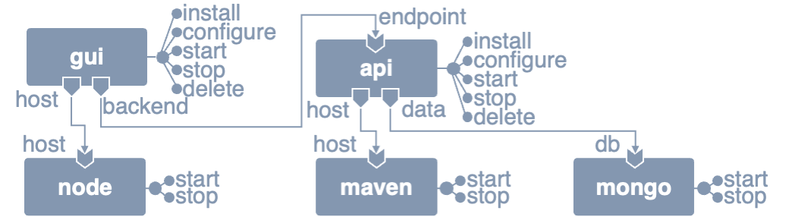

# Example - Thinking 


## Input files 

### Application Specification
[Thinking](https://github.com/di-unipi-socc/thinking) is an open-source web application that allows end-users to share what they are thinking about, so that all other end-users can read it. It is composed by three main components: (i) a _mongo_ database for storing user-shared thoughts, (ii) an _api_ managing the access to the stored thoughts, and (iii) a _gui_ to permit retrieving and adding thoughts to the shared collection. 
Whilst the _mongo_ database is obtained by directly running a MongoDB Docker container, the _gui_ and _api_ of Thinking are hosted on a NodeJS container and a Maven container.



The specification of Thinking in JSON is provided in the file [thinking.json](https://github.com/di-unipi-socc/ramp/blob/master/data/thinking-app/thinking.json). 
To update the specification of the application, or to create your own one, please adhere to the same JSON structure as in the linked JSON file.

### Global State
A possible global state for Thinking correspond to that where all its components are up and running, with just one instance of _mongo_ and of the _gui-node_ stack, and two instances of the _api-maven_ stack.
In such global state, the _gui_ is to be connected to any of the instances of the backend _api_, say _a1_, for instance.

| instance id | node | state | bindings | 
| - | - | - | - | 
| a1 | api | running | host->m1, data->d1 |
| a2 | api | running | host->m2, data->d1 |
| d1 | mongo | running | - |
| g1 | gui | working | host->n1, backend->a1 |
| n1 | node | running | - |
| m1 | maven | running | - |
| m2 | maven | running | - |

The specification of such global state in JSON is provided in the file [running-globalstate.json](https://github.com/di-unipi-socc/ramp/blob/master/data/thinking-app/running-globalstate.json). 
To update the specification of the global state, or to create your own one, please adhere to the same JSON structure as in the linked JSON file.

### Plans
Examples of plans (both sequential and workflow plans) for deploying and managing an instance of Thinking are available in sub-folders of the present folder, each containing
* an original, non-valid plan and 
* its refactored, valid version.

The currently available plans' folders are the following: 
* [deployment](https://github.com/di-unipi-socc/ramp/tree/master/data/thinking-app/deployment), which contains (sequential) plans for deploying the Thinking application and reaching the above presented global state (starting from the global state where no instance of any service is avaiable),
* [reconfigure-gui-api](https://github.com/di-unipi-socc/ramp/tree/master/data/thinking-app/reconfigure-gui-api), which contains plans for reconfiguring the running instances of _gui_ and _api_,
* [restart-api-maven](https://github.com/di-unipi-socc/ramp/tree/master/data/thinking-app/restart-api-maven), which contains plans for restarting the instances of _node_ and _maven_, and
* [undeployment](https://github.com/di-unipi-socc/ramp/tree/master/data/thinking-app/undeployment), which contains plans for undeploying the Thinking application.

By opening the corresponding folders, diagrams displaying such plans will be available in the README. 

To update the specification of a plan, or to create your own one, please adhere to the same JSON structure as in the available JSON files.

## Running the examples

RAMP can be launched to analyse the validity of the available plans with the following commands, assuming that the terminal is positioned in the main folder of the cloned repository of RAMP and that RAMP has already been compiled to have `ramp.jar` in such folder.

### Deployment Sequence 
The original sequence can be analysed with the command
```
java -jar ramp.jar data/thinking-app/thinking.json data/thinking-app/deployment/sequence.json --sequence --valid
```
whilst its refactored version can be validated with the command
```
java -jar ramp.jar data/thinking-app/thinking.json data/thinking-app/deployment/refactored-sequence.json --sequence --valid
```

### Reconfiguration Plan 
The original plan can be analysed with the command
```
java -jar ramp.jar data/thinking-app/thinking.json data/thinking-app/running-globalstate.json data/thinking-app/reconfigure-gui-api/plan.json --sequence --valid
```
whilst its refactored version can be validated with the command
```
java -jar ramp.jar data/thinking-app/thinking.json data/thinking-app/running-globalstate.json data/thinking-app/reconfigure-gui-api/refactored-plan.json --sequence --valid
```

### Restarting Plan 
The original plan can be analysed with the command
```
java -jar ramp.jar data/thinking-app/thinking.json data/thinking-app/running-globalstate.json data/thinking-app/restart-node-maven/plan.json --sequence --valid
```
whilst its refactored version can be validated with the command
```
java -jar ramp.jar data/thinking-app/thinking.json data/thinking-app/running-globalstate.json data/thinking-app/restart-node-maven/refactored-plan.json --sequence --valid
```

### Undeployment Plan 
The original plan can be analysed with the command
```
java -jar ramp.jar data/thinking-app/thinking.json data/thinking-app/running-globalstate.json data/thinking-app/undeployment/plan.json --sequence --valid
```
whilst its refactored version can be validated with the command
```
java -jar ramp.jar data/thinking-app/thinking.json data/thinking-app/running-globalstate.json data/thinking-app/undeployment/refactored-plan.json --sequence --valid
```


